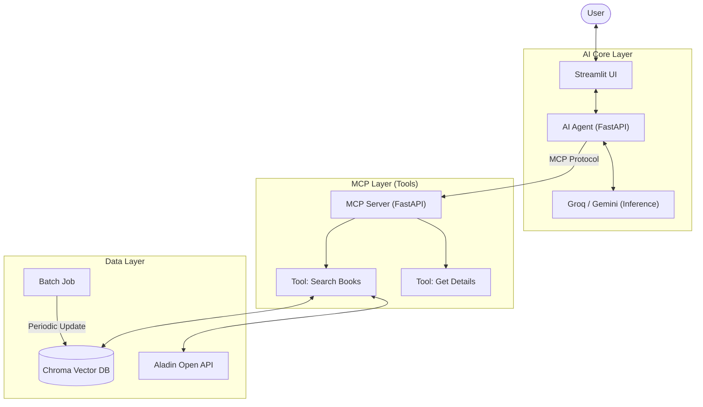

네, 요청하신 대로 **시스템 아키텍처(System Architecture)**와 **기술적 구현 방식**을 중심으로, 프로젝트가 실제로 어떤 메커니즘으로 서비스를 제공하는지 명확하게 기술한 `README.md`를 작성해 드립니다.

이 문서는 개발자나 기술적인 이해관계자가 프로젝트의 구조와 기능을 빠르게 파악하는 데 최적화되어 있습니다.

---

# 📘 Aladin AI Book Agent Service

**Aladin AI Book Agent**는 **MCP(Model Context Protocol)** 아키텍처를 기반으로 구축된 지능형 도서 추천 시스템입니다.
LLM(Large Language Model)의 추론 능력과 Vector DB의 시맨틱 검색, 그리고 외부 API의 실시간 데이터를 결합하여 사용자에게 맥락에 맞는 도서 큐레이션 서비스를 제공합니다.

---

## 🏗️ 시스템 아키텍처 (System Architecture)

이 프로젝트는 **Client-Agent-Server**의 계층형 구조로 설계되어 있으며, 각 컴포넌트는 MCP(Model Context Protocol)를 통해 느슨하게 결합(Loosely Coupled)되어 있습니다.



### 핵심 컴포넌트 구성

1. **AI Agent (`app/api/agent.py`)**: 사용자 의도를 파악하고, 필요한 도구(Tool)를 결정하는 두뇌 역할을 합니다. Groq(Llama 3.3) 또는 Gemini 모델을 사용하여 추론합니다.
2. **MCP Server (`app/mcp_server/server.py`)**: 실제 기능을 수행하는 도구(Tool)들의 집합소입니다. Agent의 요청을 받아 DB 검색이나 API 호출을 수행하고 결과를 반환합니다.
3. **Vector Store (`app/mcp_server/tools.py`)**: ChromaDB를 사용하여 도서 정보를 임베딩(Vector) 형태로 저장합니다. 단순 키워드가 아닌 문맥 기반 검색(Semantic Search)을 지원합니다.
4. **Data Pipeline (`app/batch_job_continuous.py`)**: 알라딘 API에서 베스트셀러 및 신간 데이터를 수집하여 Vector DB를 주기적으로 최신화하는 배치 시스템입니다.

---

## 🚀 주요 서비스 기능 (Service Features)

본 시스템은 단순 검색을 넘어선 **RAG(Retrieval-Augmented Generation)** 기반의 큐레이션 서비스를 제공합니다.

### 1. 하이브리드 도서 검색 (Hybrid RAG)

사용자의 질문 유형에 따라 두 가지 검색 방식을 자동으로 전환하여 최적의 결과를 제공합니다.

* **Context Search (맥락 검색):** "요즘 무기력한데 읽을만한 책 있어?"와 같은 추상적인 질문을 벡터 유사도(Cosine Similarity)로 분석하여 관련 도서를 추천합니다.
* **Keyword Search (정밀 검색):** 특정 저자나 도서명 등 고유 명사가 포함된 질문은 기존의 키워드 매칭 방식을 사용하여 정확도를 보장합니다.

### 2. 실시간 재고 및 중고가 확인 (Real-time Integration)

Vector DB에 저장된 정적 데이터(줄거리, 저자 등)와 외부 API의 동적 데이터(가격, 재고)를 결합합니다.

* **실시간 데이터 병합:** 추천된 도서의 현재 판매가와 알라딘 직배송 중고 재고 현황을 실시간으로 조회하여 사용자에게 제공합니다.
* **데이터 신뢰성 확보:** 학습된 데이터의 할루시네이션(Hallucination)을 방지하기 위해 가격 정보는 반드시 API 응답 값을 우선합니다.

### 3. 지능형 필터링 (Smart Filtering)

자연어로 된 사용자의 제약 조건을 파악하여 DB 쿼리 필터로 변환합니다.

* **지원 필터:** 가격 상한선(`max_price`), 최소 평점(`min_rating`), 특정 카테고리(`category_name`), 출간일(`min_pub_date`)
* **동작 예시:** "2만 원 이하의 최신 과학 책 추천해줘" → `{price: $lte 20000, category: '과학', pub_date: $gte 20240101}`

### 4. 데이터 최신화 파이프라인 (Continuous Batch)

* **자동 수집:** 지정된 카테고리(경제경영, 소설, 인문 등)의 베스트셀러를 주기적으로 크롤링하여 DB에 적재합니다.
* **이어달리기(Resume) 기능:** 수집 중단 시 마지막 페이지를 기억하여 중복 수집을 방지하고 효율성을 극대화했습니다.

---

## 🛠️ 기술 스택 (Tech Stack)

| Category | Technology | Description |
| --- | --- | --- |
| **LLM / AI** | **Groq (Llama 3.3)** | 초고속 추론 및 Tool Calling 수행 |
| **Backend** | **FastAPI** | 비동기 API 서버 및 MCP 서버 구현 |
| **Protocol** | **MCP** | Model Context Protocol (표준화된 AI 도구 연동) |
| **Database** | **ChromaDB** | 로컬 벡터 저장소 (임베딩 검색) |
| **Embedding** | **Sentence-Transformers** | `paraphrase-multilingual-MiniLM-L12-v2` |
| **Frontend** | **Streamlit** | 대화형 채팅 UI |
| **External API** | **Aladin TTB API** | 도서 정보 및 실시간 재고 조회 |

---

## 📂 프로젝트 구조 (Directory Structure)

```bash
├── app
│   ├── api
│   │   ├── agent.py          # AI Agent 로직 (LLM 통신 & Tool 호출)
│   │   └── main.py           # API 진입점
│   ├── mcp_server
│   │   ├── server.py         # MCP 서버 (도구 등록 및 SSE 통신)
│   │   └── tools.py          # 실제 기능 구현 (DB 검색, API 호출)
│   ├── ui
│   │   └── main.py           # Streamlit UI 코드
│   └── batch_job_continuous.py # 데이터 수집 배치 스크립트
├── chroma_db/                # Vector DB 저장 경로
├── batch_state.json          # 배치 작업 상태 저장 파일
└── pyproject.toml            # 의존성 관리 설정

```

---

## 🏁 설치 및 실행 (Getting Started)

### 1. 환경 변수 설정

`.env` 파일을 생성하고 API 키를 입력합니다.

```env
GROQ_API_KEY=your_groq_api_key
ALADIN_API_KEY=your_aladin_ttb_key

```

### 2. 의존성 설치

```bash
pip install -r requirements.txt
# 또는
pip install .

```

### 3. 데이터 초기화 (Batch Job)

최초 실행 전, 도서 데이터를 수집하여 DB를 구축합니다.

```bash
python -m app.batch_job_continuous

```

### 4. 서버 실행

**MCP 서버**와 **UI**를 각각 실행합니다.

```bash
# Terminal 1: MCP Server
python -m app.mcp_server.server

# Terminal 2: Streamlit UI
streamlit run app/ui/main.py

```